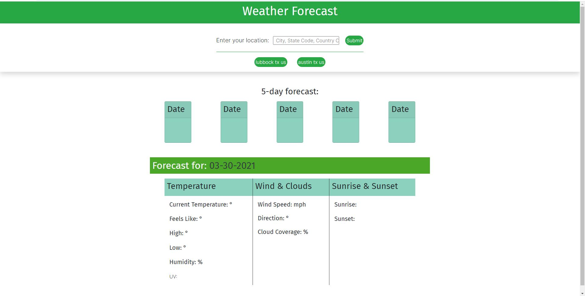
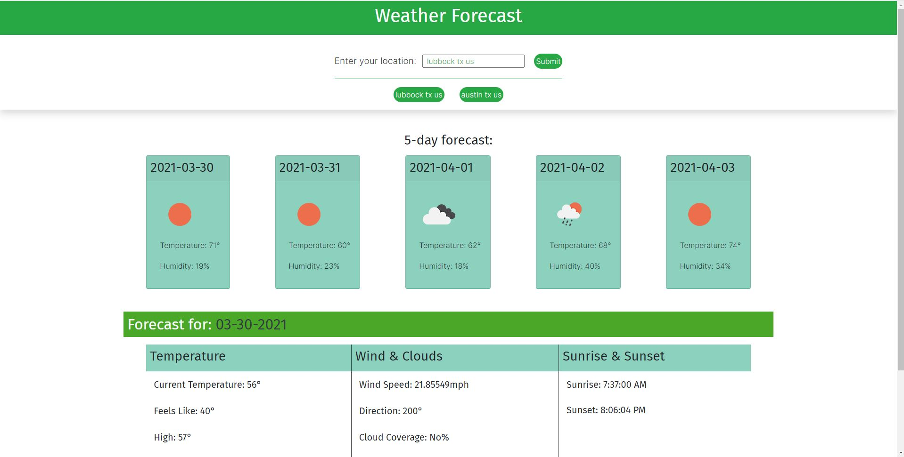
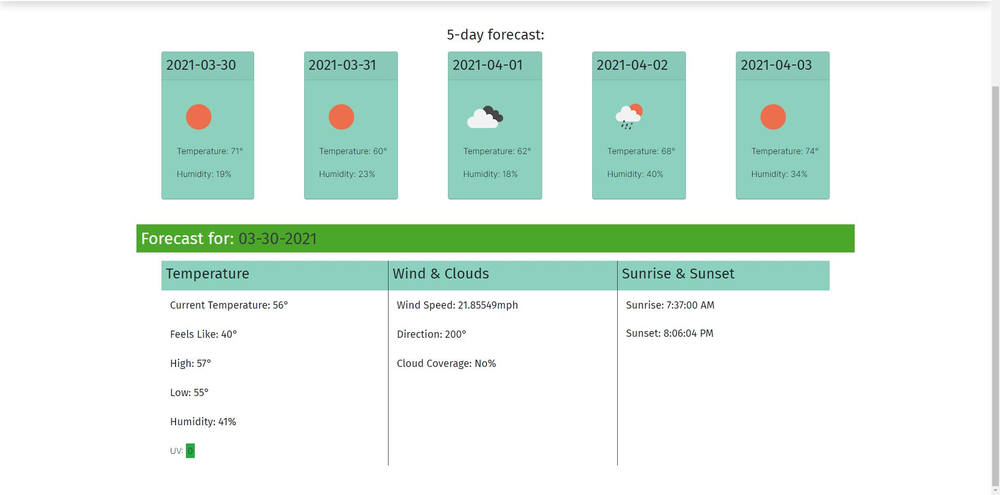

# Forecast API

## Description

### Design

Instead of the given mockup that was provided, I chose to exercise some creative liberty and make my own spin on the projects looks. I changed the layout to flow more vertically than horizontally, changes the color scheme and implemented a very different layout for the current day including having more statistics.

### How To Search

Although there were many ways the api allowed you to search I only allow 1 of them due to time contstraints. The accepted format is city, state code, country code. You can seperate them with or without commas.

### Plans for the future

I plan to allow the user to click on the cards and have that day be displayed on the bottom, large stat container and a button allowing you to reset to the current day.

### Issues

My biggest problem with this challenge would be finding a good api amoung the ones offered by the service we were provided. I found many that were locked by a premium and those that weren't didn't provide a either a good format or more than 1 day of data. In the end to get my 5 day forecast and current day statistics, I had to use a combination of the UV, 5day/3hour, and current day apis. The forecast relying solely on the 5d/3h api. I provides 3 hour increments through all 5 days, resulting in a list of 40 entries. I decided to choose only the mid day of each of those days as my stats for the forecast cards.

## Deployed project

https://brandonshoemaker.github.io/weather-forecast/

## Screenshots

## Contributions
Server Side Api: Open Weather Map, Site development: Brandon Shoemaker

